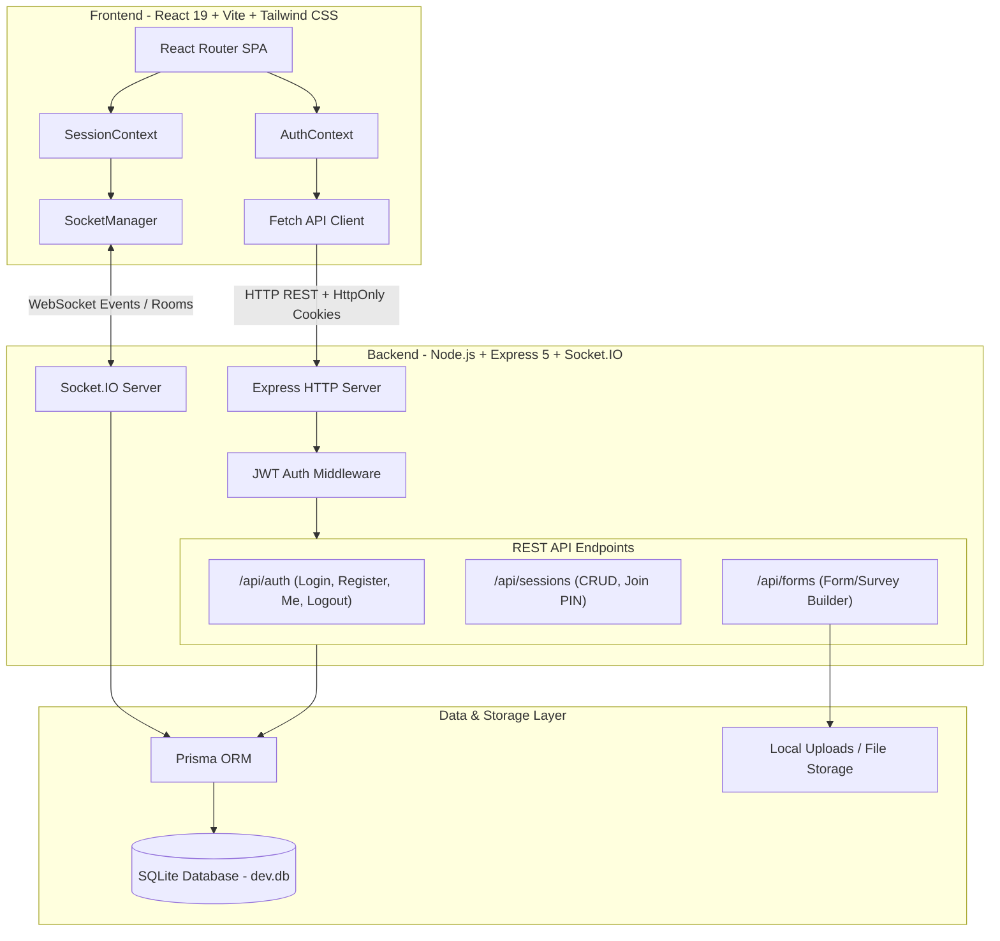
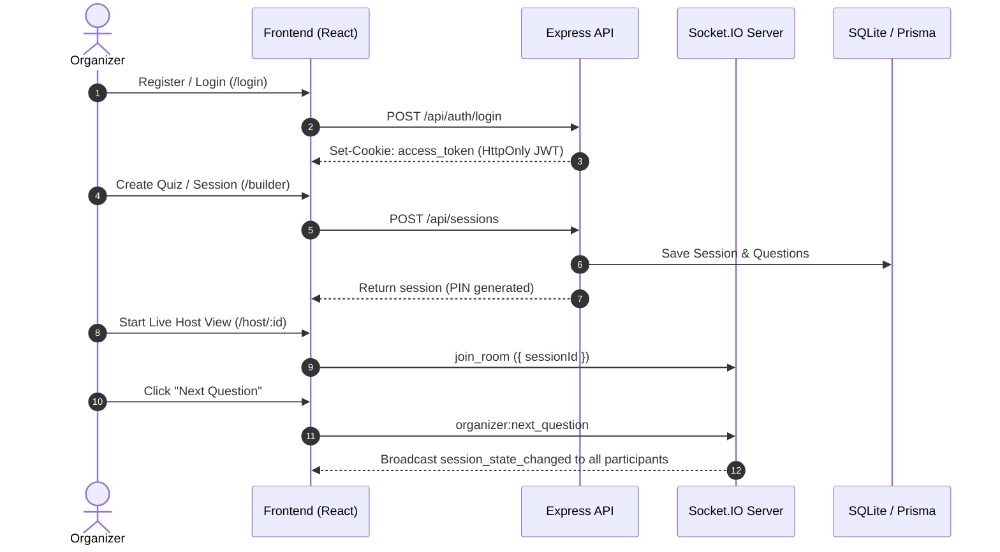
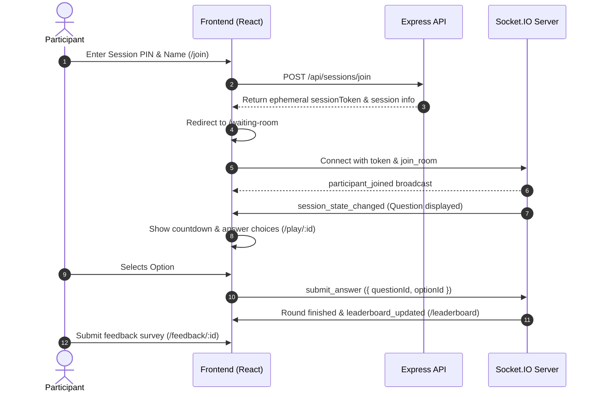

# QuizCore - Real-Time Polling & Live Quiz Platform

QuizCore is a modern, full-stack real-time interactive polling and live quiz platform. It enables organizers to create interactive quizzes and feedback forms, host live sessions with PIN codes, broadcast questions to participants in real-time, and analyze post-session engagement and leaderboards.

---

## 🏗️ System Architecture



---

## 🔄 End-to-End User & System Flows

### 1. Organizer Workflow


### 2. Participant Workflow


---

## 🛠️ Technology Stack

| Layer | Technologies |
|---|---|
| **Frontend** | React 19, Vite 8, React Router v7, Tailwind CSS v4, Lucide React |
| **State & Context** | React Context (`AuthContext`, `SessionContext`), Custom Socket Manager |
| **Backend** | Node.js, Express 5, Socket.IO 4.x, Cookie Parser, CORS, Dotenv |
| **Authentication** | JSON Web Tokens (JWT) via HttpOnly cookies (organizers) & token handshake (participants), `bcrypt` |
| **Database & ORM** | SQLite, Prisma ORM 6.x |
| **File Management** | Multer for form attachment uploads |

---

## 📂 Project Structure

```
Quizcore/
├── .env                      # Frontend environment configuration
├── index.html                # Vite HTML entry point
├── package.json              # Frontend dependencies & scripts
├── vite.config.js            # Vite bundler configuration
├── tailwind.config.js        # Tailwind CSS styling configuration
│
├── src/                      # Frontend Source Code
│   ├── api/
│   │   └── client.js         # API fetch client (REST endpoints)
│   ├── components/
│   │   ├── ProtectedRoute.jsx# Auth route guard for organizers
│   │   └── TopNavBar.jsx     # Navigation bar with responsive layout
│   ├── context/
│   │   ├── AuthContext.jsx   # Authentication state management
│   │   └── SessionContext.jsx# Live session & socket state
│   ├── pages/                # Route Views (19 screens)
│   │   ├── LandingPage.jsx
│   │   ├── Authentication.jsx
│   │   ├── Signup.jsx
│   │   ├── OrganizerDashboard.jsx
│   │   ├── SessionBuilder.jsx
│   │   ├── FormBuilder.jsx
│   │   ├── FormTemplateSelection.jsx
│   │   ├── LiveMonitoring.jsx
│   │   ├── JoinSession.jsx
│   │   ├── ParticipantWaitingRoom.jsx
│   │   ├── ParticipantLiveQuiz.jsx
│   │   ├── ParticipantQuestionResult.jsx
│   │   ├── FinalLeaderboard.jsx
│   │   ├── PostSessionAnalytics.jsx
│   │   ├── FeedbackSubmission.jsx
│   │   ├── FeedbackResponses.jsx
│   │   ├── ParticipantProfile.jsx
│   │   ├── AccountSettings.jsx
│   │   └── NotFound.jsx
│   └── sockets/
│       └── socketManager.js  # Singleton Socket.IO client
│
└── server/                   # Backend Source Code
    ├── .env                  # Backend environment configuration
    ├── dev.db                # SQLite database
    ├── index.js              # Express app & HTTP/Socket server bootstrap
    ├── sockets.js            # Socket.IO connection & room handler
    ├── package.json          # Backend dependencies & scripts
    ├── prisma.config.ts      # Prisma runtime configuration
    ├── prisma/
    │   └── schema.prisma     # Prisma schema models (User, Session, Participant, Question, Form)
    ├── routes/
    │   ├── auth.js           # /api/auth (register, login, logout, me)
    │   ├── sessions.js       # /api/sessions (CRUD, join PIN)
    │   └── forms.js          # /api/forms (multi-question form builder & file uploads)
    └── uploads/              # Stored uploaded files and images
```

---

## 🗄️ Database Schema (`Prisma`)

```prisma
model User {
  id           String    @id @default(uuid())
  email        String    @unique
  passwordHash String
  name         String
  sessions     Session[]
  forms        Form[]
  createdAt    DateTime  @default(now())
}

model Session {
  id           String        @id @default(uuid())
  pin          String        @unique
  name         String
  status       String        @default("waiting") // waiting, active, leaderboard, finished
  organizerId  String
  organizer    User          @relation(fields: [organizerId], references: [id])
  participants Participant[]
  questions    Question[]
  createdAt    DateTime      @default(now())
}

model Participant {
  id        String   @id @default(uuid())
  username  String
  score     Int      @default(0)
  sessionId String
  session   Session  @relation(fields: [sessionId], references: [id])
  joinedAt  DateTime @default(now())
}

model Question {
  id               String   @id @default(uuid())
  text             String
  options          String   // JSON string of options [{id, text, isCorrect}]
  timeLimitSeconds Int      @default(30)
  order            Int
  sessionId        String
  session          Session  @relation(fields: [sessionId], references: [id])
}

model Form {
  id           String         @id @default(uuid())
  title        String
  description  String?
  instructions String?
  status       String         @default("draft") // draft, template, published
  userId       String
  user         User           @relation(fields: [userId], references: [id])
  questions    FormQuestion[]
  createdAt    DateTime       @default(now())
  updatedAt    DateTime       @updatedAt
}

model FormQuestion {
  id            String     @id @default(uuid())
  type          String     // multiple-choice, multiple-select, true-false, short-answer, long-answer
  text          String
  options       String?    // JSON array of options
  correctAnswer String?
  marks         Int        @default(1)
  isRequired    Boolean    @default(false)
  order         Int
  formId        String
  form          Form       @relation(fields: [formId], references: [id], onDelete: Cascade)
  files         FormFile[]
}

model FormFile {
  id             String       @id @default(uuid())
  filename       String
  originalName   String
  mimetype       String
  size           Int
  formQuestionId String
  formQuestion   FormQuestion @relation(fields: [formQuestionId], references: [id], onDelete: Cascade)
}
```

---

## 🔌 API & Socket Specifications

### REST Endpoints

| Method | Endpoint | Description | Auth Required |
|---|---|---|---|
| `POST` | `/api/auth/register` | Register a new organizer account | No |
| `POST` | `/api/auth/login` | Login and obtain HttpOnly session cookie | No |
| `POST` | `/api/auth/logout` | Clear session cookie | Yes |
| `GET` | `/api/auth/me` | Fetch currently authenticated user | Yes |
| `GET` | `/api/sessions` | List all sessions created by organizer | Yes |
| `POST` | `/api/sessions` | Create a new session (auto or custom PIN) | Yes |
| `DELETE` | `/api/sessions/:id` | Delete session and associated data | Yes |
| `POST` | `/api/sessions/join` | Join session by PIN & username (returns participant token) | No |
| `GET` | `/api/forms` | Get all forms and templates | Yes |
| `POST` | `/api/forms` | Create or update a form | Yes |
| `POST` | `/api/forms/upload` | Upload media attachments for questions | Yes |

### WebSocket Events (`Socket.IO`)

| Event Name | Direction | Payload | Description |
|---|---|---|---|
| `join_room` | Client → Server | `{ sessionId }` | Join a room for a live session |
| `participant_joined` | Server → Client | `{ participantId }` | Notifies room of new attendee |
| `organizer:next_question` | Organizer → Server | `{ sessionId }` | Advances quiz to next question |
| `session_state_changed` | Server → Client | `{ status, currentQuestion }` | Broadcasts current active question |
| `submit_answer` | Participant → Server | `{ questionId, optionId }` | Records participant's answer |
| `leaderboard_updated` | Server → Client | `{ rankings: [...] }` | Broadcasts live or final scores |

---

## ⚡ Getting Started Locally

### 1. Prerequisites
- **Node.js**: v18+ (tested with v24.x)
- **npm**: v9+ (tested with v11.x)

### 2. Setup Environment Variables

**Frontend (`.env` in root):**
```env
VITE_API_BASE_URL=http://localhost:3000/api
VITE_SOCKET_URL=http://localhost:3000
```

**Backend (`server/.env`):**
```env
PORT=3000
FRONTEND_URL=http://localhost:5173
DATABASE_URL="file:./dev.db"
JWT_SECRET="your_secret_key"
```

### 3. Install & Start Servers

**Terminal 1 - Backend Server:**
```bash
cd server
npm install
npx prisma generate
npx prisma db push
npm run dev
```
*Backend runs on `http://localhost:3000`*

**Terminal 2 - Frontend Server:**
```bash
# In the root directory
npm install
npm run dev
```
*Frontend runs on `http://localhost:5173`*
